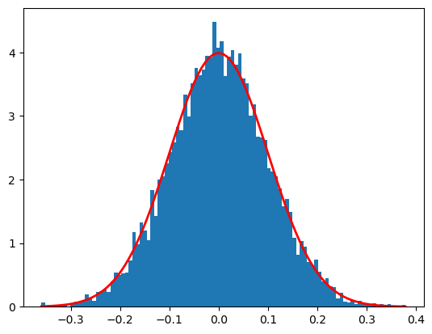

## Introducció a NumPy

Els conjunts de dades a manipular poden tindre diferents naturaleses i formats, incloent documents, imatges, sons, mesures... A pesar d'aquesta aparent heterogeitat, poden ser tractats com a conjunt d'arrays numèrics. 

Per exemple, una imatge pot ser representada com un array bidimensional de números, on cada element representa el color del pixel que ocupa a l'array. El so pot ser representat com un array unidimensional, on cada element representa la frqüència front al temps. El text pot ser convertit a representació numèrica mitjançant UTF-8. No importa la naturalesa de les dades, el primer pas en l'anàlisi de dades serà convertir aquestes dades en números.

És per això que un emmagatzematge i manipulació eficient de les dades és absolutament fonamental en el procés d'anàlisi de dades, que ens permetran la construcció de programes d'Intel·ligència Artificial.

Ací és on entra en joc NumPy (Numerical Python), que ens ajudarà a carregar, manipular i guardar dades en format numèric. Un array de NumPy serà semblant a una llista (List) de Python, però de naturalesa homogènia i numèrica. 

NumPy és molt més eficient en el tractament de dades, sobretot quan la quantitat d'informació creix. Representa el nucli de l'ecosistema de ciència de dades amb Python. Aprendre'l serà beneficiós siga quin siga el camp d'interés.

Per a instal·lar NumPy, simplement heu d'executar l'ordre:

```bash
$ conda install numpy
```

Amb la següent ordre podem comprovar si s'ha instal·lat correctament i quina és la versió que tenim instal·lada.

```python
import numpy
numpy.__version__ # 1.24.3
```

Observareu que la majoria de gent importa utilitzant l'àlias *np*:

```python
import numpy as np
```

### Numpy array vs Python List

En anteriors unitats, es va explicar que Python és un llenguatge de tipat dinàmic, per això permet la creació de llistes heterogènies:

```python
list_1 = [True, "2", 3.0, 4]
[type(item) for item in list_1] #[<class 'bool'>, <class 'str'>, <class 'float'>, <class 'int'>]
```

Però aquesta flexibilitat ve acompanyada d'un cost: cada element ha d'acompanyar-se del seu tipus, la seua posició en memòria i altra informació. Cada element és en realitat un objecte.

En canvi, si els elements son homogenis, molta d'aquesta informació seria redundant. Per això és molt més eficient aquest tipus de dades, tal com es mostra a la següent imatge:


La llista conté un punter a un bloc de punters, que apunten a cada objecte, mentre que NumPy apunta simplement a un bloc que conté les dades. És per això que és menys flexible però molt més eficient.

### NumPy Arrays

??? example "Creació d'arrays a partir de llistes"

      ```python
      # array([1, 4, 2, 5, 3])
      ay([1, 4, 2, 5, 3])

      # array([3.14, 4.  , 2.  , 3.  ])
      ay([3.14, 4, 2, 3])

      # array([1., 2., 3., 4.], dtype=float32)
      ay([1, 2, 3, 4], dtype='float32')

      # array([[2, 3, 4],
      #        [4, 5, 6],
      #        [6, 7, 8]])
      ay([range(i, i + 3) for i in [2, 4, 6]])
      ```

??? example "Creació d'arrays des de zero"

      ```python
      #array([0, 0, 0, 0, 0, 0, 0, 0, 0, 0])
      np.zeros(10, dtype=int)

      # array([[1., 1., 1., 1., 1.],
      #        [1., 1., 1., 1., 1.],
      #        [1., 1., 1., 1., 1.]])
      np.ones((3, 5), dtype=float)

      # array([[3., 3., 3., 3., 3.],
      #       [3., 3., 3., 3., 3.],
      #       [3., 3., 3., 3., 3.]])
      np.full((3, 5), 3.)

      # array([ 0,  2,  4,  6,  8, 10, 12, 14, 16, 18])
      np.arange(0, 20, 2)

      # array([0.  , 0.25, 0.5 , 0.75, 1.  ])
      np.linspace(0, 1, 5)

      # array([[0.13718193, 0.00357101, 0.01323657],
      #        [0.39090681, 0.21454034, 0.74277238],
      #        [0.38737056, 0.96167256, 0.50637694]])
      np.random.random((3, 3))

      # matriu de 3x3 amb valors enters aleatòris
      np.random.randint(0, 10, (3, 3))
      ```


??? example "Mostra aleatòria seguint una distribució normal o de Gauss"

      ```python
      mu, sigma = 0, 0.1
      s = np.random.normal(mu, sigma, 10000)
      import matplotlib.pyplot as plt
      count, bins, ignored = plt.hist(s, 100, density=True)
      plt.plot(bins, 1/(sigma * np.sqrt(2 * np.pi)) *
                  np.exp( - (bins - mu)**2 / (2 * sigma**2) ),
            linewidth=2, color='r')
      plt.show()
      ```
      

## Manipulació d'arrays de NumPy

### Atributs dels arrays
??? example "Dimensions"

      ```python
      array = np.random.randint(10, size=(3, 4, 5))  # Array de tres dimensions
      print("número de dimensions: ", array.ndim)
      print("forma:", array.shape)
      print("tamany: ", array.size)
      ```
      número de dimensions:  3  
      forma: (3, 4, 5)  
      tamany:  60

??? example "Tipus i espai ocupat per les dades"

      ```python
      print("tipus de dades:", array.dtype)
      print("tamany d'element:", array.itemsize, "bytes")
      print("tamany total:", array.nbytes, "bytes")
      ```

      tipus de dades: int64  
      tamany d'element: 8 bytes  
      tamany total: 480 bytes

### Accés
??? example "Accés als elements d'un array"

      ```python
      array = np.random.randint(10, size=6)
      print(array)
      print(array[3])
      print(array[-2])
      ```  
      [5 3 2 6 9 3]  
      6  
      9

      ```python
      array = np.random.randint(10, size=(3, 4))
      print(array)
      print(array[2, 0])
      print(array[2, -1])
      ```
      [[0 8 7 7]  
       [1 5 2 7]  
       [4 3 4 6]]  
      4  
      6

      ```python
      array[0, 0] = 12
      print(array)
      ```
      [[12  8  7  7]  
      [ 1  5  2  7]  
      [ 4  3  4  6]]

??? question "Pregunta"
      
      Com quedarà la variable array després de la següent assignació?
      
      ```python
      array[0, 0] = 3.14159
      ```

??? success "Comprovar resposta"
      [[3  8  7  7]  
      [ 1  5  2  7]  
      [ 4  3  4  6]]

??? question "Pregunta"

      Com quedarà la variable array després de la següent assignació?

      ```python
      array[1] = 3
      ```

??? success "Comprovar resposta"
      [[3  8  7  7]  
      [ 3  3  3  3]  
      [ 4  3  4  6]]  

  


### Subarrays

#### Unidimensionals

La forma general d'accedir a subarrays és:
```python
x[principi:fi:pas]
```  
on els valors per defcte són `principi=0, fi=tamany de la dimensió, pas=1`.

??? example "Accedint a subarrays en arrays unidimensionals"

      ```python
      x = np.arange(10) # array([0, 1, 2, 3, 4, 5, 6, 7, 8, 9])
      x[:5] # array([0, 1, 2, 3, 4])
      x[4:7] # array([4, 5, 6])
      x[::2] # array([0, 2, 4, 6, 8])
      x[1::2] # array([1, 3, 5, 7, 9])
      ```

??? warning "Compte amb passos negatius"

      ```python
      x[::-1]  # array([9, 8, 7, 6, 5, 4, 3, 2, 1, 0])
      ```
??? question inline "Pregunta"

      Què contindrà la variable subarray al següent fragment de codi?  
      
      ```python
      import numpy as np
      x = np.arange(10)
      subarray = x[5::-2]
      ```

??? success "Comprovar resposta"

      ```python
      array([5, 3, 1])
      ```

#### Multidimensionals

??? example "Accedint a arrays multidimensionals"

      ```python
      x2 = np.array([[12,  5,  2,  4],
             [ 7,  6,  8,  8],
             [ 1,  6,  7,  7]])

      x2[:2, :3]  # array([[12,  5,  2],
                  #        [ 7,  6,  8]])

      x2[:3, ::2] # array([[12,  2],
                  #        [ 7,  8],
                  #        [ 1,  7]])

      x2[::-1, ::-1] # array([[ 7,  7,  6,  1],
                     #        [ 8,  8,  6,  7],
                     #        [ 4,  2,  5, 12]])
      ```

??? example "Accedint a files o columnes"

      ```python
      x2[:, 0]    # array([12,  7,  1])

      x2[1, :]    # array([7, 6, 8, 8])
      ```

??? warning "Accés per files abreviat"

      ```python
      x2[0] # seria equivalent a x2[0, :]
      ```

??? danger "Subarrays com a vistes, no com a còpies"

      Una cosa a tindre molt en compte és que l'accés a un subarray no torna una còpia del mateix sinó una *vista*. És diferent en l'accés a llistes de Python, on les subllistes si que són còpies de l'objecte original.  
      Açò implica que treballant amb grans agrupacions de dades, nosaltres podem accedir i processar un subconjunt sense necessitat de copiar les dades.

      ```python
      x2_sub = x2[:2, :2] # array([[12,  5],
                          #        [ 7,  6]])
      x2_sub[0, 0] = 99
      x2    # array([[99,  5,  2,  4],
            #        [ 7,  6,  8,  8],
            #        [ 1,  6,  7,  7]])
      ```

#### Còpies d'arrays

En cas que vulgam crear una còpia d'un array, podem fer ús del mètode *copy()*.

??? example "Còpia d'un subarray"

      ```python
      x2_sub_copy = x2[:2, :2].copy()
      x2_sub_copy[0, 0] = 42
      x2    # array([[99,  5,  2,  4],
            #        [ 7,  6,  8,  8],
            #        [ 1,  6,  7,  7]])
      x2_sub_copy # array([[42,  5],
                  #        [ 7,  6]])
      ```

### Canvi de dimensions

Una altra operació molt útil sobre arrays és el canvi de dimensions.

??? example "Canvi de dimensions"

      ```python
      grid = np.arange(1, 10).reshape((3, 3)) # array([[1, 2, 3],
                                              #        [4, 5, 6],
                                              #        [7, 8, 9]])
      ```

### Unió i separació

Per a unir 